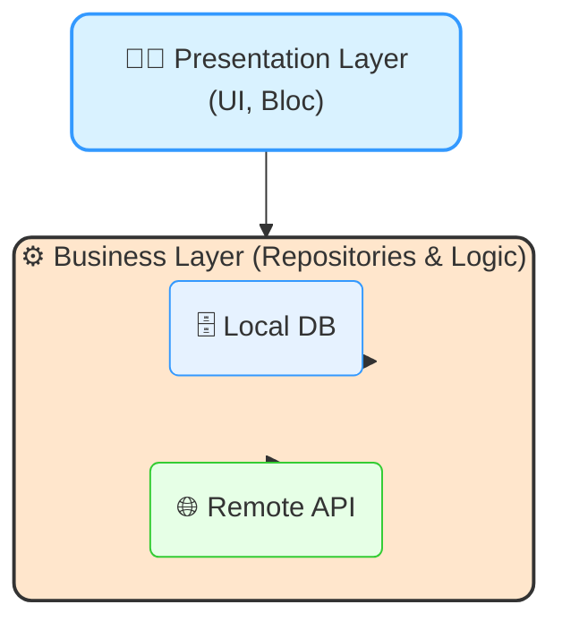
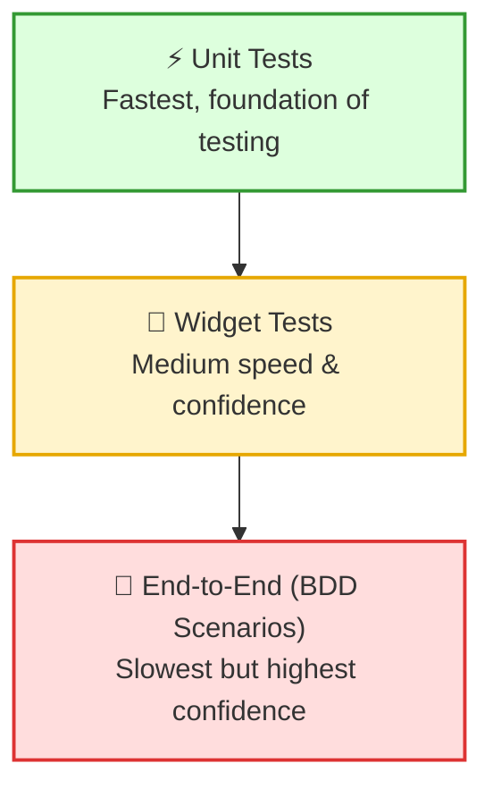

# 📰 News App

A **modular Flutter application** built with a simplified clean architecture approach, tailored for **CRUD-based apps** with **standalone features**.

---

## 📑 Table of Contents

- [About](#about)
- [Setup](#setup)
- [Getting Started](#getting-started)
- [Project Structure](#project-structure)
- [Architecture](#about-architecture)
- [Testing strategy](#testing-strategy)

---

## 📖 About <a id="about"></a>

The **News App** is a simple Flutter application demonstrating a **feature-based modular architecture**.  
It is designed to keep the codebase **scalable, testable, and easy to maintain**, while remaining **lightweight** for CRUD-focused use cases.

---

## ⚙️ Setup <a id="setup"></a>

1. Install **Flutter** version `3.32.8`
2. Activate [Melos](https://pub.dev/packages/melos) for workspace management


---

## 🚀 Getting Started <a id="getting-started"></a>

Run the project locally:

```bash
# 1) Clone
git clone https://github.com/magamal/news_flutter.git
cd news_flutter

# 2) Bootstrap Melos workspace
melos bootstrap

# 3) Generate needed files
melos rebuild

# 4) Run the app
flutter run
```

---

## 🗂️ Project Structure <a id="project-structure"></a>

The project follows **clean architecture principles** with a **feature-based modular structure**.

```
news-app/
├── packages/
│   ├── app/                          # App module (main app widget, setup)
│   ├── core/                         # Base classes and shared utilities
│   │   ├── core_domain/              # Base domain & business logic
│   │   ├── core_testing/             # Shared testing utilities
│   │   ├── core_ui/                  # Shared UI setup & widgets
│   │   ├── shared_pref/              # Shared Preferences wrapper
│   ├── di/                           # Dependency injection setup
│   ├── features/                     # Application features
│   │   ├── news/                     # News feature (listing, favorites, etc.)
│   │   │   ├── news_business/        # Business logic layer
│   │   │   ├── news_presentation/    # Presentation layer (Bloc, UI)
│   ├── localization/                 # i18n & localization support
│   ├── navigation/                   # App navigation system
│   ├── utils/                        # Utility classes
├── melos.yaml                        # Melos workspace config
├── pubspec.yaml                      # Dart dependencies
```

---

## 🏗️ Architecture <a id="about-architecture"></a>

This architecture is designed for **CRUD-based applications** with **modular, standalone features**.
Each feature is organized as a separate module, making the project **scalable**, **maintainable**, and **easy to extend**.

### 📦 Feature-Based Modular Structure

Each feature lives inside the `features/` directory and is split into **two layers**:

```
features/                            # Root folder for all app features
├── news/                            # Example: News feature
│   ├── news_business/               # Business logic layer (repositories, data sources)
│   ├── news_presentation/           # Presentation layer (UI, Bloc, widgets)
```

> 🧩 **Each feature is standalone** and self-contained — it can be developed, tested, and maintained independently.

### 🧠 Why Only Two Layers?

* **Presentation Layer** → UI & state management (e.g., Bloc)
* **Business Layer** → Repositories & logic that interact with data sources

We intentionally **omit a dedicated Domain Layer** (entities, use cases) to keep CRUD apps simple.
The **Bloc (UI)** communicates directly with **repositories**.

### 🔗 Feature Architecture Diagram




### ✅ Benefits of This Approach

* 🔍 **Clear separation of concerns**
* 📦 **Independent feature development**
* 🚀 **Fast iteration for CRUD apps**
* 🧠 **Lower cognitive overhead** (no extra layers unless needed)
* 🧪 **Easier testing** at the feature level

---


## 🔬 Testing Strategy <a id="testing-strategy"></a>

We follow a **Behavior-Driven Development (BDD)** approach for testing, ensuring that tests are written in a way that reflects the actual behavior and requirements of the app.  
This allows us to validate features **end-to-end** against real user scenarios rather than just isolated units.


### ✅ Benefits of the BDD Approach

- 🧩 **Comprehensive coverage** → Ensures that all test cases align with the scenarios defined by testers and product requirements.  
- 🔄 **Easier maintenance** → Test cases remain stable even when implementation changes, since they are based on user behavior rather than code details.  
- ⚡ **Faster feature delivery** → Reduces the time needed to validate features by focusing on user flows instead of low-level code.  
- 👥 **Improved collaboration** → Provides a shared language between developers, testers, and product owners, making requirements easier to understand and verify.  


### 🧪 How We Use BDD Scenarios

We use the [bdd_widget_test](https://pub.dev/packages/bdd_widget_test) package to write scenarios and test cases.  
This library allows us to express tests in a **`Given → When → Then`** format, making them more readable and aligned with product requirements.


> 📌 With this approach, our tests act as **living documentation**, clearly describing how features are expected to behave.


### 🔺 The Testing Pyramid

We follow the **testing pyramid** principle to balance speed, confidence, and coverage:



* **Unit Tests** → Validate individual classes, functions, or blocs.
* **Widget Tests** → Validate UI components and widget interactions.
* **BDD (End-to-End) Tests** → Validate full user scenarios across layers.

---

### 📂 Where to Find Tests

To keep things organized, tests are structured alongside features and core modules:<br>
you could find the bdd test cases and scenarios in every **feature_presentation** module in **test** folder

```
features/                            # 
├── news/                            # Feature folder
│   ├── news_business/               # 
│   ├── news_presentation/           # Presentation layer (UI, Bloc, widgets)
│   │   ├──test                      # Bdd test cases and scenarios
```

### 🚀 Running Tests

Run all BDD tests in all **presentation modules**:

```bash
melos test
```

